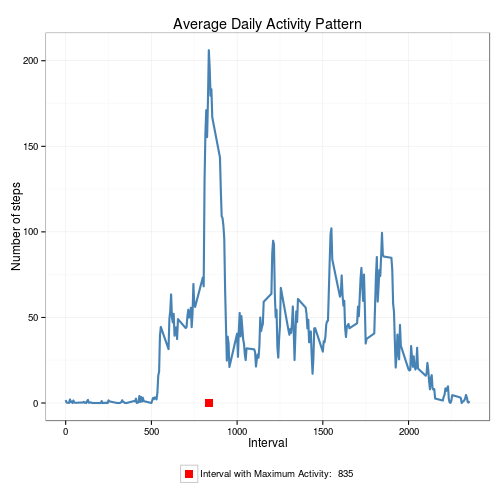

# Reproducible Research: Peer Assessment 1

This assignment makes use of data from a personal activity monitoring device. This device collects data at 5 minute intervals through out the day. The data consists of two months of data from an anonymous individual collected during the months of October and November, 2012 and include the number of steps taken in 5 minute intervals each day.

## Loading and preprocessing the data

1. Check for the presence of data file. If absent then download it.
2. Next step is to uncompress and read file into a data frame.
3. The converstion of interval column to factor type is carried out and data column converted to Date type.
4. Summary and str methods are used to understand the data.


```r
library(ggplot2) 

# download, read & convert columns 
read_data <- function() {
    fname = "activity.zip"
    source_url = "https://d396qusza40orc.cloudfront.net/repdata%2Fdata%2Factivity.zip"
    
    if(!file.exists(fname)) {
        download.file(source_url, destfile=fname, method="curl")
    }
    
    con <- unz(fname, "activity.csv")
    tbl <- read.csv(con, header=T, colClasses=c("numeric", "character", "numeric"))
    tbl$interval <- factor(tbl$interval)
    tbl$date <- as.Date(tbl$date, format="%Y-%m-%d")
    tbl
}

tbl <- read_data()

# data summary
summary(tbl)
```

```
##      steps            date               interval    
##  Min.   :  0.0   Min.   :2012-10-01   0      :   61  
##  1st Qu.:  0.0   1st Qu.:2012-10-16   5      :   61  
##  Median :  0.0   Median :2012-10-31   10     :   61  
##  Mean   : 37.4   Mean   :2012-10-31   15     :   61  
##  3rd Qu.: 12.0   3rd Qu.:2012-11-15   20     :   61  
##  Max.   :806.0   Max.   :2012-11-30   25     :   61  
##  NA's   :2304                         (Other):17202
```

```r
str(tbl)
```

```
## 'data.frame':	17568 obs. of  3 variables:
##  $ steps   : num  NA NA NA NA NA NA NA NA NA NA ...
##  $ date    : Date, format: "2012-10-01" "2012-10-01" ...
##  $ interval: Factor w/ 288 levels "0","5","10","15",..: 1 2 3 4 5 6 7 8 9 10 ...
```

## What is mean total number of steps taken per day?

Here a histogram of the daily total number of steps taken is created and then plotted with an interval having 1500 steps. Also, the mean and the meadian is displayed in the plots.


```r
calc_steps <- function(tbl) {
    steps_per_day <- aggregate(steps ~ date, tbl, sum)
    colnames(steps_per_day) <- c("date", "steps")
    steps_per_day
}

plot_steps <- function(steps_per_day, mean, median) {
    col_labels=c(paste("Mean:", mean), paste("Median:", median))
    cols = c("green", "yellow")
    
    ggplot(steps_per_day, aes(x=steps)) + 
        geom_histogram(fill="steelblue", binwidth=1500) + 
        geom_point(aes(x=mean, y=0, color="green"), size=4, shape=15) + 
        geom_point(aes(x=median, y=0, color="yellow"), size=4, shape=15) + 
        scale_color_manual(name=element_blank(), labels=col_labels, values=cols) + 
        labs(title="Steps per Day", x="Number of Steps", y="Day") + 
        theme_bw() + theme(legend.position = "bottom")    
}

steps_per_day <- calc_steps(tbl)
mean_steps = round(mean(steps_per_day$steps), 2)
median_steps = round(median(steps_per_day$steps), 2)
plot_steps(steps_per_day, mean, median)
```

```
## Error: cannot coerce type 'closure' to vector of type 'character'
```

## What is the average daily activity pattern?

A plot of number of steps v/s the interval number is created below. Also, the maximum number of steps on the average is also shown.


```r
calc_steps <- function(tbl) {
    steps_pi <- aggregate(tbl$steps, by=list(interval=tbl$interval),
                          FUN=mean, na.rm=T)
    # convert to integers for plotting
    steps_pi$interval <- as.integer(levels(steps_pi$interval)[steps_pi$interval])
    colnames(steps_pi) <- c("interval", "steps")
    steps_pi
}

plot_activity_pattern <- function(steps_per_interval, max_step_interval) {
    col_labels=c(paste("Interval with Maximum Activity: ", max_step_interval))
    cols = c("red")
    
    ggplot(steps_per_interval, aes(x=interval, y=steps)) +   
        geom_line(color="steelblue", size=1) +  
        geom_point(aes(x=max_step_interval, y=0, color="red"), size=4, shape=15) +  
        scale_color_manual(name=element_blank(), labels=col_labels, values=cols) +     
        labs(title="Average Daily Activity Pattern", x="Interval", y="Number of steps") +  
        theme_bw() + theme(legend.position = "bottom")
}

steps_per_interval <- calc_steps(tbl)
max_step_interval <- steps_per_interval[which.max(steps_per_interval$steps),]$interval

plot_activity_pattern(steps_per_interval, max_step_interval)
```

 

## Imputing missing values

The missing values are accounted for by replacing them with the mean value corresponing to the same interval across days. 


```r
impute_means <- function(tbl, defaults) {
    na_indices <- which(is.na(tbl$steps))
    defaults <- steps_per_interval
    na_replacements <- unlist(lapply(na_indices, FUN=function(idx){
        interval = tbl[idx,]$interval
        defaults[defaults$interval == interval,]$steps
        }))
    imp_steps <- tbl$steps
    imp_steps[na_indices] <- na_replacements
    imp_steps
}
complete_tbl <- data.frame(  
    steps = impute_means(tbl, steps_per_interval),  
    date = tbl$date,  
    interval = tbl$interval)

summary(complete_tbl)
```

```
##      steps            date               interval    
##  Min.   :  0.0   Min.   :2012-10-01   0      :   61  
##  1st Qu.:  0.0   1st Qu.:2012-10-16   5      :   61  
##  Median :  0.0   Median :2012-10-31   10     :   61  
##  Mean   : 37.4   Mean   :2012-10-31   15     :   61  
##  3rd Qu.: 27.0   3rd Qu.:2012-11-15   20     :   61  
##  Max.   :806.0   Max.   :2012-11-30   25     :   61  
##                                       (Other):17202
```

The results are as folows.


```r
complete_steps_per_day <- calc_steps_per_day(complete_tbl)
```

```
## Error: could not find function "calc_steps_per_day"
```

```r
complete_mean_steps = round(mean(complete_steps_per_day$steps), 2)
```

```
## Error: object 'complete_steps_per_day' not found
```

```r
complete_median_steps = round(median(complete_steps_per_day$steps), 2)
```

```
## Error: object 'complete_steps_per_day' not found
```

```r
plot_steps_per_day(complete_steps_per_day, complete_mean_steps, complete_median_steps)
```

```
## Error: could not find function "plot_steps_per_day"
```

## Are there differences in activity patterns between weekdays and weekends?

We do this comparison with the table with filled-in missing values.

1. Augment the table with a column that indicates the day of the week
2. Subset the table into two parts - weekends (Saturday and Sunday) and weekdays (Monday through Friday).
3. Tabulate the average steps per interval for each dataset.
4. Plot the two datasets side by side for comparison.


```r
calc_day_of_week_data <- function(tbl) {
    tbl$weekday <- as.factor(weekdays(tbl$date))
    weekend_data <- subset(tbl, weekday %in% c("Saturday","Sunday"))
    weekday_data <- subset(tbl, !weekday %in% c("Saturday","Sunday"))
    
    weekend_spi <- calc_steps_per_interval(weekend_data)
    weekday_spi <- calc_steps_per_interval(weekday_data)
    
    weekend_spi$dayofweek <- rep("weekend", nrow(weekend_spi))
    weekday_spi$dayofweek <- rep("weekday", nrow(weekday_spi))
    
    day_of_week_data <- rbind(weekend_spi, weekday_spi)
    day_of_week_data$dayofweek <- as.factor(day_of_week_data$dayofweek)
    day_of_week_data
}
plot_day_of_week_comparison <- function(dow_data) {
    ggplot(dow_data, 
        aes(x=interval, y=steps)) + 
        geom_line(color="steelblue", size=1) + 
        facet_wrap(~ dayofweek, nrow=2, ncol=1) +
        labs(x="Interval", y="Number of steps") +
        theme_bw()
}
day_of_week_data <- calc_day_of_week_data(complete_tbl)
```

```
## Error: could not find function "calc_steps_per_interval"
```

```r
plot_day_of_week_comparison(day_of_week_data)
```

```
## Error: object 'day_of_week_data' not found
```

